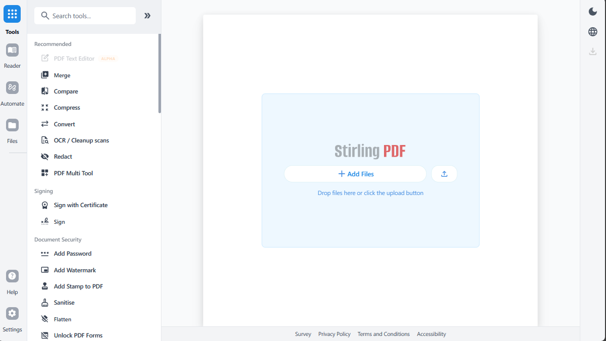

<p align="center">
  
</p>

<h1 align="center">Surgical PDF Engine – Precision Certificate Editing & Vector Export</h1>

**Surgical PDF Engine** is a purpose‑built, open‑source PDF editing platform for certificates and official documents. Forked from [Stirling-PDF](https://github.com/Stirling-Tools/Stirling-PDF), it provides a surgical toolset: OCR text extraction, white‑out redaction, and exact‑coordinate text placement. The result is a clean, searchable, and precisely corrected PDF — all running locally or on your own server.

<p align="center">
  <a href="https://github.com/Oracle69digitalmarketing/Stirling-PDF">
    
  </a>
  <a href="https://github.com/Stirling-Tools/Stirling-PDF">
    
  </a>
</p>



## Why Surgical PDF Engine?

Editing a certificate traditionally requires sending sensitive data to an external service or manually tweaking a Word document. With Surgical PDF Engine, you:

- **Keep everything on‑prem or private cloud** – no external uploads.
- **Use a proven, 50+ tool PDF platform** as the foundation.
- **Follow a simple, repeatable workflow** specifically designed for certificates.

## The Surgical Workflow

1. **Upload** your certificate.
2. **OCR the document** – turn scanned image into searchable text.
3. **Redact (white‑out)** the old text you want to replace.
4. **Add new text** at exact coordinates with the “Add Stamp/Text” tool.
5. **Download** the corrected PDF.

That’s it. No custom code needed – the power is already built in.

## Key Capabilities (Inherited from Stirling-PDF)

- **50+ PDF tools** – merge, split, sign, compress, convert, and more.
- **Automation & workflows** – no‑code pipelines in the UI; REST APIs for programmatic use.
- **Enterprise‑grade** – SSO, auditing, on‑prem deployments (Stirling-PDF foundation).
- **40+ languages** – global interface.

## Customizations in This Fork

| Area | Change |
|------|--------|
| **App name** | `Surgical PDF Engine` (browser tab, header) |
| **Navbar title** | `Certificate Editor` |
| **Homepage hero** | `Surgical PDF Engine` / `Precision Certificate Editing & Vector Export` |
| **HTML metadata** | Title and description updated |
| **Manifests** | PWA short name set to `Surgical PDF` |
| **Default settings** | `ui.appNameNavbar` set to `Certificate Editor` |

These changes are baked directly into the code – no environment variables required.

## Quick Start

### Using the Pre‑Built Image (Original Stirling-PDF)

```bash
docker run -p 8080:8080 stirlingpdf/stirling-pdf:latest
```

Build Your Custom Fork (Surgical PDF Engine)

```bash
git clone https://github.com/Oracle69digitalmarketing/Stirling-PDF.git
cd Stirling-PDF
docker build -t surgical-pdf-engine .
docker run -p 8080:8080 surgical-pdf-engine
```

Then open: http://localhost:8080

For full installation options (including desktop and Kubernetes), refer to the original documentation.

Resources

· Original Stirling-PDF Documentation
· Original API Docs
· Community Discord (Stirling-PDF community)

Credits & License

Surgical PDF Engine is a fork of Stirling-PDF, the #1 PDF application on GitHub.
It remains under the same open‑core license as the original project (see LICENSE).
